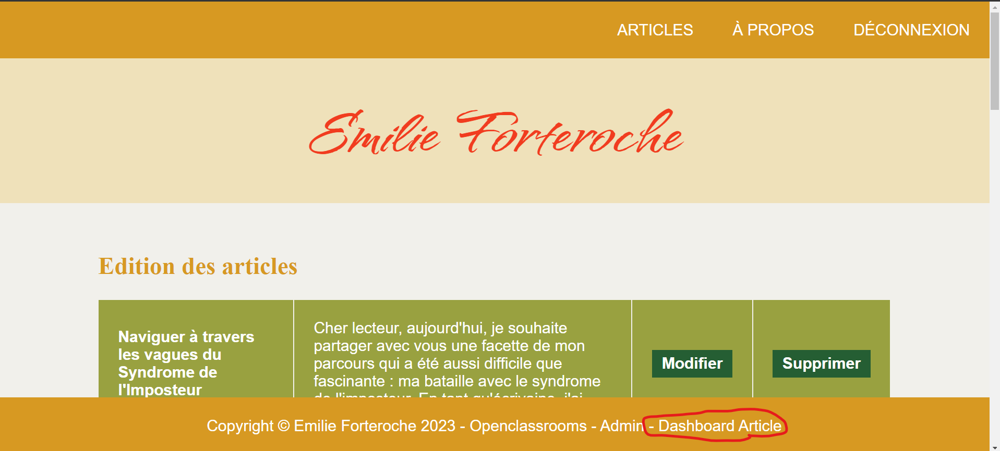
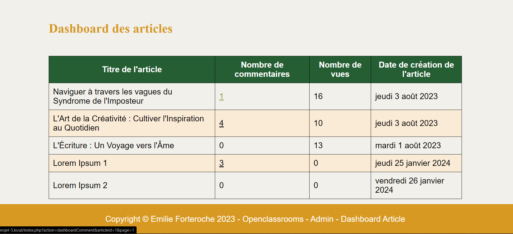

## Blog d'Emilie Forteroche

## Modifications apportés :

### Affichage du nombre de vue, de commentaires et de la date de publication d'un article : 
Les modifications concernant les l'affichage du nombre de vue, de commentaire, ainsi que de la date publication d'un article, ont été implémentées dans une nouvelles pages que vous pouvez retrouver en cliquant sur "Dashboard Article" dans le menu en bas de la page.

La création d'une nouvelle action pour cette page ce situe dans la fonction "dashboardArticle()" dans la classe controllers/AdminController.php 

### l'ajout d'un méthode de suppression d'un commentaire depuis le back office du site. 

Afin de mieux administrer la gestion des commentaires, une nouvelle interfaces a été mis en places afin de gérer directement l'ensemble des commentaires d'un article. 
Cette fonctionnalité est accessible en cliquant sur le nombre de commentaires d'un article depuis le tableau disponible dans la page Dashboard. 

La création d'une nouvelle action pour cette page ce trouve dans la fonction "dashboardComment()" dans la classe controllers/CommentController.php

### Le tri par ordre croissant ou décroissant : 

Pour trier une colonne du dashboard article ou du dashboard comment, il suffit de cliquer sur le titre d'une des colonnes. 

La gestion du tri du tableau "Dashboard article" se trouve dans la fonction "getAllArticles()" dans la classe models/ArticleManager.php . 
La gestion du tableau "Dashboard commentaire" se trouve quand à elle dans la fonction "getAllCommentsByArticleId()" dans la classe models/CommentManager.php .

## Pour utiliser ce projet : 

- Commencer par cloner le projet. 
- installez le projet chez vous, dans un dossier exécuté par un serveur local (type MAMP, WAMP, LAMP, etc...)
- Une fois installé chez vous, créez un base de données vide appelée : "blog_forteroche"
- Importez le fichier _blog_forteroche.sql_ dans votre base de données.

## Lancez le projet ! 

Pour la configuration du projet renomez le fichier _\_config.php_ (dans le dossier _config_) en _config.php_ et éditez le si nécessaire. 
Ce fichier contient notamment les informations de connextion à la base de données. 

Pour vous connecter en partie admin, le login est "Emilie" et le mot de passe est "password" (attention aux majuscules)

## Problèmes courants :

Il est possible que la librairie intl ne soit pas activée sur votre serveur par défaut. Cette librairie sert notamment à traduire les dates en francais. Dans ce cas, vous pouvez soit utiliser l'interface de votre serveur local pour activer l'extention (wamp), soit aller modifier directement le fichier _php.ini_. 

Ce projet a été réalisé avec PHP 8.2. Bien que d'autres versions de PHP puissent fonctionner, il n'est pas garanti que le projet fonctionne avec des versions antérieures.

## Copyright : 

Projet utilisé dans le cadre d'une formation Openclassrooms. 
